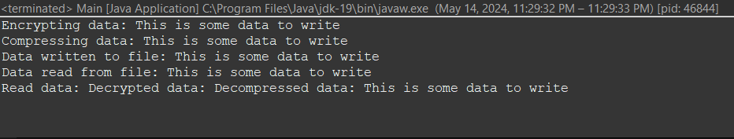
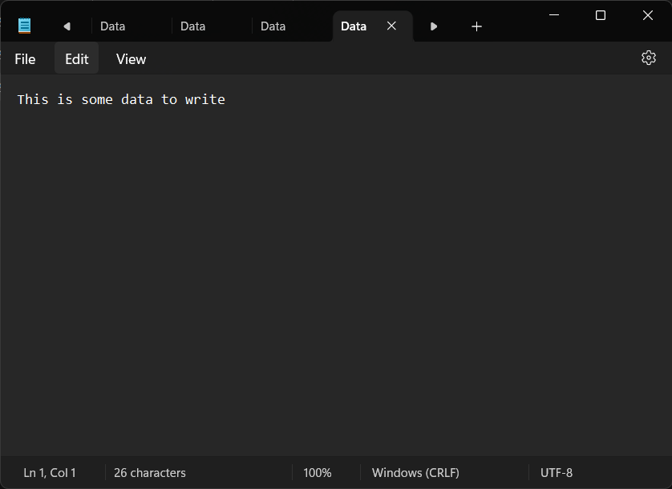

# Decorator Report
---
## Introduction
A structural design pattern called the Decorator pattern makes it possible to dynamically add behavior to an object. It offers a versatile substitute for subclassing for enhancing an object's functionality in runtime. Open-closed design is encouraged by the Decorator pattern, which makes it possible to add new behaviors to an object without changing the original code.

We'll talk about a sample Java implementation of the Decorator pattern in this report. The application shows how to add encryption and compression features to a file data source using decorators.
## Manual
Let's go over the stages involved in the software so that you can comprehend it:

1. **Interface DataSource:** The data sources contract is defined by this interface. It outlines how data should be written and read.

2. **Class FileDataSource:** The `DataSource` interface is implemented by this class, which also offers methods for reading and writing data to and from files. It uses Java's `BufferedWriter` and `BufferedReader` classes to conduct file I/O operations.

3. The class **DataSourceDecorator:** The base decorator for data sources is this abstract class. It maintains a reference to another `DataSource` object and implements the `DataSource` interface. It offers concrete decorators a standard framework to adhere to.

4. The class **EncryptionDecorator:** By extending `DataSourceDecorator`, this class gives the data source encryption capabilities. Before handing off the write operation to the wrapped data source, it alters the `writeData` method to encrypt the data. After assigning the read operation to the wrapped data source, it additionally overrides the `readData` method to decrypt the data.

5. The class **CompressionDecorator:** By extending `DataSourceDecorator`, this class gives the data source compression capabilities. Prior to handing off the write operation to the wrapped data source, it alters the `writeData` method to compress the data. Additionally, after assigning the read operation to the wrapped data source, it overrides the `readData` method to decompress the data.

6. **Primary class:** This is where the program starts. An instance of `FileDataSource} is created, and `CompressionDecorator` and `EncryptionDecorator} are wrapped around it. After that, it reads back data that has been written to the wrapped data source.
## GitHub Repository
Link to GitHub Repository: [Decorator Repo](https://github.com/Roche14328/Decorator)

## Key Code Explanations
Sure, let's go through each of the Java files and explain their purpose and functionality:

### FileDataSource.java
```java
import java.io.*;

public class FileDataSource implements DataSource {
    private String fileName;

    public FileDataSource(String fileName) {
        this.fileName = fileName;
    }

    @Override
    public void writeData(String data) {
        try (BufferedWriter writer = new BufferedWriter(new FileWriter(fileName))) {
            writer.write(data);
            System.out.println("Data written to file: " + data);
        } catch (IOException e) {
            System.out.println("Error writing data to file: " + e.getMessage());
        }
    }

    @Override
    public String readData() {
        try (BufferedReader reader = new BufferedReader(new FileReader(fileName))) {
            String line;
            StringBuilder content = new StringBuilder();
            while ((line = reader.readLine()) != null) {
                content.append(line);
            }
            System.out.println("Data read from file: " + content.toString());
            return content.toString();
        } catch (IOException e) {
            System.out.println("Error reading data from file: " + e.getMessage());
        }
        return null;
    }
}
```

### DataSource.java
```java
public interface DataSource {
    void writeData(String data);
    String readData();
}
```
- **Purpose**: This interface defines the contract for data sources. It specifies methods for writing and reading data.
- **Methods**:
  - `writeData(String data)`: Writes data to a data source.
  - `readData()`: Reads data from a data source.

### DataSourceDecorator.java
```java
public abstract class DataSourceDecorator implements DataSource {
    protected DataSource wrappee;

    public DataSourceDecorator(DataSource wrappee) {
        this.wrappee = wrappee;
    }
}
```

### EncryptionDecorator.java
```java
public class EncryptionDecorator extends DataSourceDecorator {
    public EncryptionDecorator(DataSource wrappee) {
        super(wrappee);
    }

    @Override
    public void writeData(String data) {
        // Additional encryption logic
        System.out.println("Encrypting data: " + data);
        wrappee.writeData(data);
    }

    @Override
    public String readData() {
        // Additional decryption logic
        return "Decrypted data: " + wrappee.readData();
    }
}
```

### CompressionDecorator.java
```java
public class CompressionDecorator extends DataSourceDecorator {
    public CompressionDecorator(DataSource wrappee) {
        super(wrappee);
    }

    @Override
    public void writeData(String data) {
        // Additional compression logic
        System.out.println("Compressing data: " + data);
        wrappee.writeData(data);
    }

    @Override
    public String readData() {
        // Additional decompression logic
        return "Decompressed data: " + wrappee.readData();
    }
}
```


### Main.java
```java
public class Main {
    public static void main(String[] args) {
        String filePath = "E:\\SDUST\\3rd year\\2nd Semester\\Soft Design &Arch\\Exp\\Decorator Practice\\Data.txt";
        DataSource dataSource = new FileDataSource(filePath);
        dataSource = new CompressionDecorator(dataSource);
        dataSource = new EncryptionDecorator(dataSource);

        String data = "This is some data to write";
        dataSource.writeData(data);
        String readData = dataSource.readData();

        System.out.println("Read data: " + readData);
    }
}
```
Let's examine the main components of the code in more detail:

- Concrete decorators have a common structure thanks to the `DataSourceDecorator` class. In addition to holding a reference to another `DataSource` object ({wrappee}), it implements the `DataSource` interface. Because of this, decorators can wrap a data source and increase its capabilities.

- The encryption capability is added to the `DataSourceDecorator` class via the `EncryptionDecorator` class. Before handing off the write operation to the wrapped data source, it alters the `writeData` method to encrypt the data. After assigning the read operation to the wrapped data source, it additionally overrides the `readData` method to decrypt the data.

- Compression capability is added to the `DataSourceDecorator` class via the `CompressionDecorator` class. Prior to handing off the write operation to the wrapped data source, it alters the `writeData` method to compress the data. Additionally, after assigning the read operation to the wrapped data source, it overrides the `readData` method to decompress the data.

- To add compression and encryption functionality, we create an instance of `FileDataSource} in the `Main` class and surround it with `CompressionDecorator` and `EncryptionDecorator}. We then show how decorators can extend the functionality of the basic data source by writing data to the wrapped data source and reading it back.


## Screenshots




## Development Challenges and Solutions
As the decorator pattern implementation was being developed, a number of significant issues were addressed:

The `EncryptionDecorator` and `CompressionDecorator` decorator classes were developed to dynamically add new features to the base data source (`FileDataSource}).

- By extending the `DataSourceDecorator` abstract class, the decorators adhere to a standard structure, making it easier to add new decorators in the future.

- The software effectively illustrates how the base data source may be enhanced with encryption and compression features using the decorator pattern without changing the source code.

It's important to remember, too, that the decorator pattern can add extra complexity to the codebase—particularly if there are a lot of decorators or intricate relationships between them. The decorators should be carefully designed, and care should be taken to guarantee that they follow the idea of single responsibility.


## Conclusion

An effective technique for giving objects dynamic and adaptable behavior at runtime is the decorator pattern. It supports the open-closed paradigm by enabling capability expansion without changing the current code.

We looked at a sample Java implementation of the decorator pattern in this paper. We looked at the code organization, the functions of each class and interface, and the ways that decorators might enhance a file data source with encryption and compression features.

Developers can gain a high degree of extension and flexibility in their codebases by utilizing the decorator approach. By simply wrapping objects in the right decorators, new functionality can be introduced, allowing for the construction of intricate combinations of behaviors.

In general, the decorator pattern is an advantageous design pattern that can improve the software systems' versatility and modularity. It offers a mechanism for dynamically adding and removing responsibilities from objects, enhancing flexibility and facilitating code reuse.

---